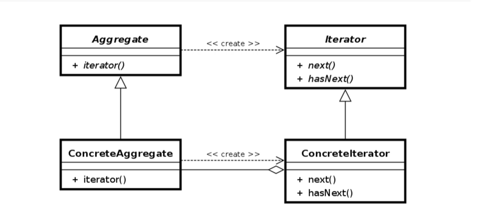

## GOF - GANG OF FOUR

  

- Design Patterns

- Creational Patterns

- Structural Patterns

- Behavioral Patterns

  

### Key POINTS

- Reusable solution for repeatable task and issues

- Template of solution

- Can be customized

- GoF Patterns describe 23 design patterns (4 Main Groups)

  


## CREATIONAL PATTERNS

### Singletone Design Pattern

  

> Ensure that a class has only one instance and provide a global point of access to it.

  

- Declare private static field of same type

- Make constructor private

- Declare static function as public, that will return instance of this class (accessor function)

- - Return reference to same object

  

### Prototype Pattern

  

- Add clone() method to hierarchy of our objects

- Design registry that maintains a cache of prototype objects

- Use Factory API instead of NEW keyword to instantiate the objects.

  

### Factory Method

  

- Define hierarchy of objects

- Design arguments for the factory method.

- Factory method to instantiate new object you need

  

### Builder Pattern

#### Traditional builder

1. Declare builder interfaces

2. Create multiple builders

3. Create director that can work with different builders

4. Instantiate director and concrete implementation of builder

  

#### Chain Builder

1. Create inner Builder class inside type that we want to build

2. Implement method in type that returns reference to the builder object

3. Declare setter in builder that returns the reference to this builder object

4. Implement build() method to terminate method chain and return target

5. Call method get reference to builder and build object step-by-step

  

### Abstract Factory

- Implement class groups (type families)

- Declare Abstract Factory interface with factory method per product

- Use Abstract factory to instantiate group of related objects

- Greater abstraction of Factory-Method

- Advantages:

	- Clean Code

	- Compability between products


## STRUCTURAL PATTERNS


### Proxy


- control interaction with a object

- control access to original object

- It is often used in Aspect-Oriented Programming 

- Implementation:

		1. Declare interface for wrapper and for original type

		2. Create proxy type that implements interface

		3. Aggregate object that you want to wrap in proxy type

		4. Implement logic of interaction with original object

### Decorator
  

  - flexible alternative to the inheritance mechanize for extending functionality

  - It let attach new behaviors to objects by wrapping inside special object

  - Aggregation/composition is the key principle to the Decorator

  - Implementation:
 
		  1. Define common context

		  2. Create decorator type

		  3. Core and decorator class implement same interface with common context

		  4. Create different features that can be added to the common context by extending or implementing decorator type.

		  5. Implement additional and enhanced functionality in decorator classes

### Adapter


- solving incompatible interfaces with your system:

- Causes:

  - migration of system and some interfaces are not matching each other 

  - third party library but has different interface that doesn't match needs

- Real Life Example: 

  - different type of power adapter in different countries

- Adapter wrap existing class with new interface

- create Adapter class that handle all translation

- Implementation:

		1. Identify the interface that you need

		2. Identify type that you need to adopt

		3. Create Adapter that implements target interface and aggregate type that you need to adopt. Wrapper class should have reference to adapted class.

		4. Instantiate adapter and use it as adapter

### Facade


- Simplified interface to a library, framework or any complex class/set

- Create multiple level of abstraction to hide unnecessary details of some complex functionality

- Define high-level interface that makes subsystems easier to use

- Help to learn system faster

- Example:

	- Complex B2B Systems
```
- Implementation:

	- Define business cases and scenarios 

	- Define facade interface that describes behavior to interact with subsystem

	- Aggregate all necessary types inside facade

	- Get Instance of facade and use it
```

### Analysis of Structural pattern similar behaviors


### Bridge

- split a large class or a set of closely related
- decouple abstraction from it's implementation
- separation and abstraction are separated in different classes
```
- Implementation: 
	- Think about operation that would be needed (describe this in abstraction class)
	- If we need new orations - create new abstraction class
	- If we have hierarchy that can be enhanced independently
	- design the separation of concerns - separate abstraction of implementation of behavior
```

### Flyweight


- fit more objects into the available amount of RAM by sharing common parts of state
- sharing state between objects (Particle effects)
- not store duplicated state and the same data in each object
- store only inner state and pass state as arguments
- we can also create a factory of a flyways
```
- Implementation:
	- split state of object to inner and outer state (understand which state are shared across all objects and what is unique)
	- Create where constant fields will be initialized through constructor
	- Outer state can be passed as method arguments
	- Create factory flyways that will cache shared state and will return already existing object. Client will only request object with specific state and not creating new.
	- Client should store or generate outer state and pass it as an argument to flyweight
```

### Composite

- Group objects in tree like structure
- Use when the core model of your app can be represented as a tree
- we don't need care about the concrete classes of objects that compose the tree 
- example: 
- work with `Products` and `Boxes` through a common interface which declares a method for calculating the total price

- Interact with whole tree objects as a single object
```
- Implementation:
	- can apply tree-like shape
	- United interface that will combine operations on the group of objects and on the single object
	- Create class of single object
	- Create class for group of object that implements the same united interface
	- Add operations to add and remove components into the container
```


## BEHAVIORAL PATTERNS	

### STRATEGY

- Used to specify how something should be done
- How something should be done
- Create abstraction and multiple inteface tahan descriebe how something should be done
- example: group of soring algorithm, group of filter algorithm (group of similar algorithm)
- Avoid describe logic in client classes
- 
- Strategy pattern is to create class that does something specific in a lot of different ways
	- extract all of these algorithms into seperate classes (strategies)
```
- Implementations:
	- Identify group of algorihms
	- create interface for group of algorithms
	- Concrete classes that implements inteface and concrete algorthms
	- Use strategy in client code
```
- Applicability:
	- similar classes that only differ in their behaviour
	- when we want use different variants of algorthm within object
	- isolate business logic of details of algorithm
	- when class have masive conditional operator that swithc between different variants of algorithm


### COMMAND

- Used ti create object out of what needs to be done
- How we can create object from our request
- Group of related command unite under common abstraction (client relay on abstraction)
- Good software desing -> principle of separation of concerns
- Command pattern suggest that GUI objects should not send requests directly instead extarct all request details into separate command class
- Command objects serve as link between gui and business logic
```
- Implementations:
	- Identify the command entry point
	- Common interfaace for commands
	- Create implmentation of inteface
	- Each command should store reference to reciver object
	- Store all neccesary arguments in command to pass to reciver
	- Add command to the requester object
	- Invoke commands method and pass all necessary arguments to interact with reciver 
```

- Applicability:
	- when we want parametrize object with operations
	- when we want queue operations, schedule their execution or execute them remotely
	- when we want implments reversible operations


### TEMPLATE METHOD

- AbstractClass - declare methods and act as steps of an algorithms (template methods) which call these method in specific order. Steps be declared abstract or have some default implementation
- ConcreteClassX - override all of steps but not the template method itself  
<br><br>
- Define skeleton of algorithm and let sublcasses decide the implmentation
- Subclasses provide implmentation of some steps of common algorithm without changing algorithm structure
- Example: Algorihm for data processing of documents is the same only diference is how data is retrived from the files of different format
- Create template of eacth steps of algorithm that give us implmentation of the common steps, avoiding code duplication.
- Real Life Example: Company of building house (different doors, roof, windows (steps))
```
- Implementation:
	- Examin algorithm and split into steps
	- Create Abstract class and define template method
	- Each step of algorithm into different method
	- Describe method invocation sequence in template method
	- Identify place for hooks in your algorithm
	- Create Concrete classes that implmentes the required steps in the algorithm
```

- Applicability:
	- When we want to let clients extend only particular steps of an algorithm.
	- When we have several classes that contains almost identical algorithms with some minor diffrences.


### ITERATOR

- Allow us to go over each element of an aggregation object sequentailly without exposing its underlaying representation
- Allow us to iterate over array, vector, tree or some other container (we dont need to know undelaying structure of container)
- We only need know interface that allow us to iterate over container one by one.
- Put all logic of iteration in the sperate class
- Iteration track progress of iteration and state of iteration
<br><br>

<br><br>
```
- Implementation:
	- Define interator inteface (most important method hasNext and next). Other method optional
	- Object that server as container declare method that return an iterator
	- Create implmentation of iterator interface for collections
	- Client request iterator and use iteration over elements of container
```
- Applicability:
	- When collection have complexe data structure, but you want hide complexity from clients
	- When we need reduce duplication of the traversal code
	- When we want our code to traverse different data structure


### CHAIN OF RESPONSIBILITY

- Allow us process one request by multiple handlers
- Handlers are chained and each handler is process that pass request to turther to next link in the chain
- Example filter in web page that indntify is logged user is admin or normal user. This whole process going through group of chains.
-- Example of request filters<br><br>
<br><br>
```
- Implementation:
	-  Create interface of event handler and declare method for event handling
	- Each implementaion of chain must contain reference to the next link in the chain
	- Each chain interface implmentaion contriubtes to the event handling
	- If object need pass forward to chaing, link object calls the method on the next element in the chain
	- Client create chaind depending on the business logic and start chain from root
```
- Applicability:
	- When process expected to process different kinds of request in various ways (exact type and sequence are unknown  beforehand)
	- When we need execute several handlers in particular orders
	- When handlers and orders are supposed to change at runtime
## Refrerences


1. [Refactoring Guru](https://refactoring.guru/design-patterns)

2. [Desing Pattern in TypeScript (git)](https://github.com/gztchan/design-patterns-in-typescript)
